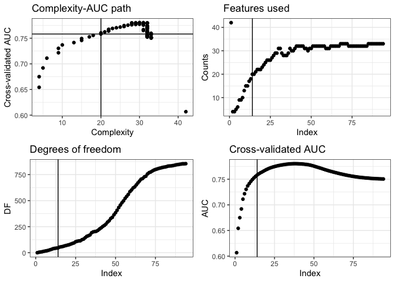
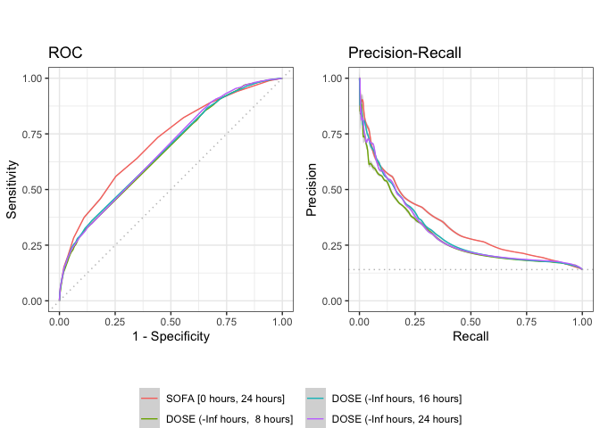
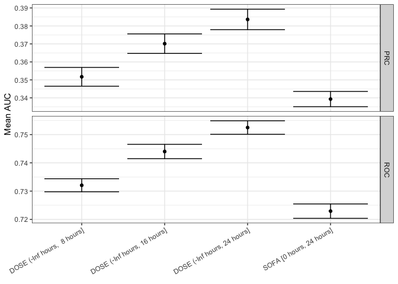
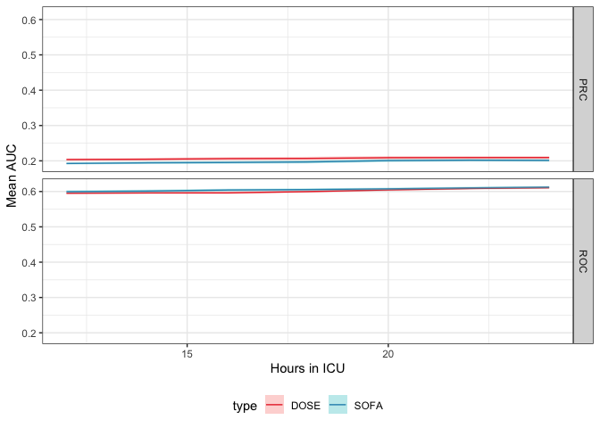

<!-- README.md is generated from README.Rmd. Please edit that file -->
DOSE - Data-driven Organ Severity Evaluation
============================================

This repository contains all the code that was used to develop the data-driven organ severity evaluation (DOSE) score (Poster P381 at ISICEM 2020, also soon to be available online). The entirety of the code will be uploaded in the coming weeks.

``` r
dat <- load_data("mimic", cfg, hours(-Inf), hours(dose_wins))

train <- dat[[1L]]
train_id <- sample(nrow(train), 0.75 * nrow(train))
train <- train[train_id, ]

dose <- train_dose(train, method = dose_glm, model_ind = 14)
```



<table>
<thead>
<tr>
<th style="text-align:left;">
</th>
<th style="text-align:left;">
Points
</th>
</tr>
</thead>
<tbody>
<tr grouplength="2">
<td colspan="2" style="border-bottom: 1px solid;">
<strong>asparate aminotransferase</strong>
</td>
</tr>
<tr>
<td style="text-align:left; padding-left: 2em;" indentlevel="1">
&ge; 62
</td>
<td style="text-align:left;">
1
</td>
</tr>
<tr>
<td style="text-align:left; padding-left: 2em;" indentlevel="1">
&ge; 67
</td>
<td style="text-align:left;">
2
</td>
</tr>
<tr grouplength="3">
<td colspan="2" style="border-bottom: 1px solid;">
<strong>bicarbonate</strong>
</td>
</tr>
<tr>
<td style="text-align:left; padding-left: 2em;" indentlevel="1">
&lt; 17
</td>
<td style="text-align:left;">
2
</td>
</tr>
<tr>
<td style="text-align:left; padding-left: 2em;" indentlevel="1">
&lt; 19
</td>
<td style="text-align:left;">
1
</td>
</tr>
<tr>
<td style="text-align:left; padding-left: 2em;" indentlevel="1">
&lt; 20
</td>
<td style="text-align:left;">
1
</td>
</tr>
<tr grouplength="2">
<td colspan="2" style="border-bottom: 1px solid;">
<strong>bilirubin total</strong>
</td>
</tr>
<tr>
<td style="text-align:left; padding-left: 2em;" indentlevel="1">
&ge; 2
</td>
<td style="text-align:left;">
1
</td>
</tr>
<tr>
<td style="text-align:left; padding-left: 2em;" indentlevel="1">
&ge; 7
</td>
<td style="text-align:left;">
8
</td>
</tr>
<tr grouplength="2">
<td colspan="2" style="border-bottom: 1px solid;">
<strong>calculated total co2</strong>
</td>
</tr>
<tr>
<td style="text-align:left; padding-left: 2em;" indentlevel="1">
&lt; 17
</td>
<td style="text-align:left;">
3
</td>
</tr>
<tr>
<td style="text-align:left; padding-left: 2em;" indentlevel="1">
&lt; 18
</td>
<td style="text-align:left;">
2
</td>
</tr>
<tr grouplength="1">
<td colspan="2" style="border-bottom: 1px solid;">
<strong>creatinine</strong>
</td>
</tr>
<tr>
<td style="text-align:left; padding-left: 2em;" indentlevel="1">
&ge; 1.1
</td>
<td style="text-align:left;">
1
</td>
</tr>
<tr grouplength="1">
<td colspan="2" style="border-bottom: 1px solid;">
<strong>diastolic bp</strong>
</td>
</tr>
<tr>
<td style="text-align:left; padding-left: 2em;" indentlevel="1">
&lt; 40
</td>
<td style="text-align:left;">
3
</td>
</tr>
<tr grouplength="4">
<td colspan="2" style="border-bottom: 1px solid;">
<strong>lactate</strong>
</td>
</tr>
<tr>
<td style="text-align:left; padding-left: 2em;" indentlevel="1">
&ge; 4
</td>
<td style="text-align:left;">
1
</td>
</tr>
<tr>
<td style="text-align:left; padding-left: 2em;" indentlevel="1">
&ge; 5
</td>
<td style="text-align:left;">
4
</td>
</tr>
<tr>
<td style="text-align:left; padding-left: 2em;" indentlevel="1">
&ge; 7
</td>
<td style="text-align:left;">
3
</td>
</tr>
<tr>
<td style="text-align:left; padding-left: 2em;" indentlevel="1">
&ge; 9
</td>
<td style="text-align:left;">
2
</td>
</tr>
<tr grouplength="4">
<td colspan="2" style="border-bottom: 1px solid;">
<strong>lymphocytes</strong>
</td>
</tr>
<tr>
<td style="text-align:left; padding-left: 2em;" indentlevel="1">
&lt; 5
</td>
<td style="text-align:left;">
1
</td>
</tr>
<tr>
<td style="text-align:left; padding-left: 2em;" indentlevel="1">
&lt; 7
</td>
<td style="text-align:left;">
2
</td>
</tr>
<tr>
<td style="text-align:left; padding-left: 2em;" indentlevel="1">
&lt; 9
</td>
<td style="text-align:left;">
1
</td>
</tr>
<tr>
<td style="text-align:left; padding-left: 2em;" indentlevel="1">
&lt; 10.5
</td>
<td style="text-align:left;">
2
</td>
</tr>
<tr grouplength="1">
<td colspan="2" style="border-bottom: 1px solid;">
<strong>mchc</strong>
</td>
</tr>
<tr>
<td style="text-align:left; padding-left: 2em;" indentlevel="1">
&lt; 32.1
</td>
<td style="text-align:left;">
1
</td>
</tr>
<tr grouplength="1">
<td colspan="2" style="border-bottom: 1px solid;">
<strong>ph</strong>
</td>
</tr>
<tr>
<td style="text-align:left; padding-left: 2em;" indentlevel="1">
&lt; 7.1
</td>
<td style="text-align:left;">
5
</td>
</tr>
<tr grouplength="2">
<td colspan="2" style="border-bottom: 1px solid;">
<strong>phosphate</strong>
</td>
</tr>
<tr>
<td style="text-align:left; padding-left: 2em;" indentlevel="1">
&ge; 3.9
</td>
<td style="text-align:left;">
3
</td>
</tr>
<tr>
<td style="text-align:left; padding-left: 2em;" indentlevel="1">
&ge; 4.9
</td>
<td style="text-align:left;">
4
</td>
</tr>
<tr grouplength="2">
<td colspan="2" style="border-bottom: 1px solid;">
<strong>platelet count</strong>
</td>
</tr>
<tr>
<td style="text-align:left; padding-left: 2em;" indentlevel="1">
&lt; 80
</td>
<td style="text-align:left;">
3
</td>
</tr>
<tr>
<td style="text-align:left; padding-left: 2em;" indentlevel="1">
&lt; 105
</td>
<td style="text-align:left;">
1
</td>
</tr>
<tr grouplength="1">
<td colspan="2" style="border-bottom: 1px solid;">
<strong>prothrombine time</strong>
</td>
</tr>
<tr>
<td style="text-align:left; padding-left: 2em;" indentlevel="1">
&ge; 18.5
</td>
<td style="text-align:left;">
3
</td>
</tr>
<tr grouplength="3">
<td colspan="2" style="border-bottom: 1px solid;">
<strong>rdw</strong>
</td>
</tr>
<tr>
<td style="text-align:left; padding-left: 2em;" indentlevel="1">
&ge; 17
</td>
<td style="text-align:left;">
1
</td>
</tr>
<tr>
<td style="text-align:left; padding-left: 2em;" indentlevel="1">
&ge; 18
</td>
<td style="text-align:left;">
2
</td>
</tr>
<tr>
<td style="text-align:left; padding-left: 2em;" indentlevel="1">
&ge; 19
</td>
<td style="text-align:left;">
5
</td>
</tr>
</tbody>
</table>
The DOSE score, trained on 75% of MIMIC data, 8 hours into ICU stay, is now evaluated on the remaining 25% of data for hours 8, 16, 24 and compared to SOFA at hour 24.

``` r
test <- lapply(dat, function(x) x[-train_id, ])

within <- dose_eval(dose, test)
mimic  <- sofa_eval("mimic", hours(sofa_win), cohort = within)
```



Next, we evaluate the DOSE score trained on MIMIC, using data from eICU.

``` r
eicu  <- load_data("eicu", cfg, hours(-Inf), hours(dose_wins))

betw1 <- dose_eval(dose, eicu)
scor1 <- sofa_eval("eicu", hours(sofa_win), cohort = betw1)
```



And finally, we evaluate DOSE trained on MIMIC, using data from HiRID and we visualize how this behaves over time.

``` r
times <- hours(seq.int(12, 24, 2))

hirid <- load_data("hirid", cfg, hours(-Inf), hours(times))
betw2 <- dose_eval(dose, hirid)
scor2 <- sofa_eval("hirid", times, cohort = betw2)
```


