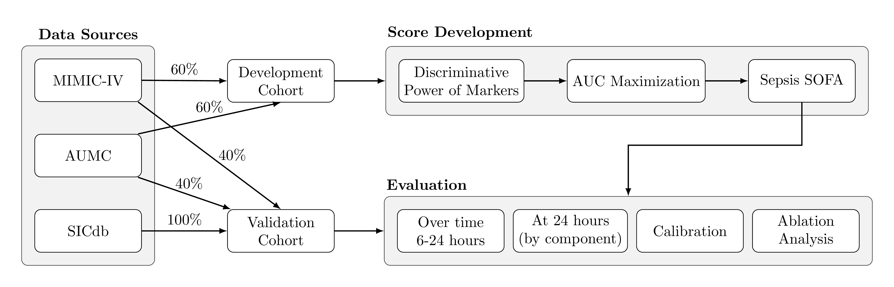

<!-- README.md is generated from README.Rmd. Please edit that file -->

# A Framework and Analytical Exploration for a Data-Driven Update of the Sequential Organ Failure Assessment (SOFA) Score in Sepsis

This repository contains all the code that was used to develop the
data-driven Sepsis SOFA score, in the paper "
A Framework and Analytical Exploration for a Data-Driven Update of the Sequential 
Organ Failure Assessment (SOFA) Score in Sepsis" by D. Plecko, N. Bennett, I.F. Ukor, N. Rodemund,
A. Serpa-Neto, P. Bühlmann.

  
  
<b>Figure: Framework Diagram.</b>

All of the code used for reproducing the analyses can be found in the `scripts/`
folder. Data loading was performed using the [ricu R-package](https://github.com/eth-mds/ricu).
Installation of dependencies in `r/zzz-deps.R` is also required. For each of the
figures/tables appearing in the manuscript, the `main.R` file contains a pointer
to the corresponding script that generates it, and allows the user to reproduce
the result.

